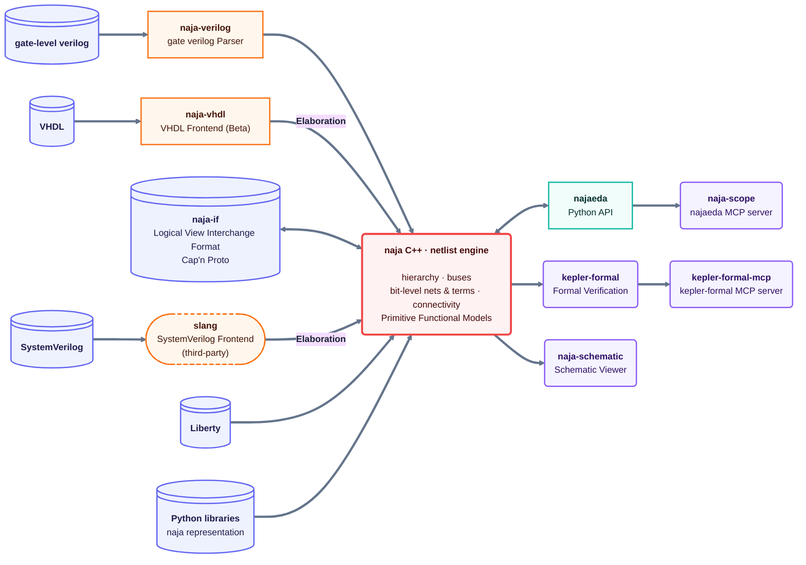

<div align="center">
  <a href="https://keplertech.io">
    <picture>
      <source media="(prefers-color-scheme: dark)" srcset="https://raw.githubusercontent.com/keplertech/.github/main/profile/keplertech-wordmark-dark.svg">
      
    </picture>
  </a>
</div>

**Open EDA tools, built for AI agents.**

KeplerTech builds open-source EDA tools designed to be driven by AI agents, and usable standalone by engineers. The tools contain no AI: the agent brings the reasoning, the tools bring exact, reproducible results.

- **Open source:** public on GitHub and PyPI under Apache-2.0. Transparent code, auditable by your own team.
- **Agent-ready:** exact, structured, bounded answers. High performance and multi-threaded, so the agent loop never stalls.
- **No AI inside:** fully deterministic. Same question, same answer, every time.

## The agent loop: explore, edit, verify, show

1. **Explore** with [naja-scope](https://github.com/keplertech/naja-scope): exact, token-bounded answers on RTL and netlists.
2. **Edit** with any AI agent (any model, any MCP client), which decides and edits through [najaeda](https://pypi.org/project/najaeda/).
3. **Verify** with [kepler-formal](https://github.com/keplertech/kepler-formal): proves each RTL or netlist edit keeps the same behavior.
4. **Show** with [naja-schematic](https://github.com/keplertech/naja-schematic): renders the design and formal diagnoses.

Loop until equivalence is proven. The loop works on RTL and netlists, before place and route: the agent edits RTL or netlists (refactor, optimize, fix), and each change is proven before it is kept.

## Ecosystem

Every tool is built on [naja](https://github.com/najaeda/naja), our open-source C++ netlist engine, and [najaeda](https://pypi.org/project/najaeda/), its Python package. Each tool works on its own, for engineers as well as for agents.



## Tools

| Tool | What it does |
| --- | --- |
| [naja-scope](https://github.com/keplertech/naja-scope) | MCP server giving drivers, loads, logic cones and source lines to any MCP client. On CVA6 (RISC-V core): 17/17 correct answers vs 10/17 with grep, with about 5x fewer input tokens (182k vs 888k). Details in the naja-scope README. |
| [kepler-formal](https://github.com/keplertech/kepler-formal) | Formal verification that two design versions behave identically. RTL SEC checks the sequential behavior of SystemVerilog before vs after a change. Also gate-level LEC and SEC. Used by OpenROAD for flow regression. |
| [kepler-formal-mcp](https://github.com/keplertech/kepler-formal-mcp) | MCP server for kepler-formal. |
| [kepler-formal-action](https://github.com/keplertech/kepler-formal-action) | GitHub Action running equivalence checks on RTL and gate-level design changes in CI. |
| [naja-schematic](https://github.com/keplertech/naja-schematic) | Schematic viewer for netlists and formal diagnoses. Opens in the browser and in VS Code. |
| [naja](https://github.com/najaeda/naja) + [najaeda](https://pypi.org/project/najaeda/) | The common API. RTL and gate-level designs, hierarchy and bit-level connectivity, primitive functional models, optimization and editing. |

## Build your own tool

Write scripts on the same API to analyze and transform your designs and automate your flow:

```bash
pip install najaeda
```

Documentation: [najaeda.readthedocs.io](https://najaeda.readthedocs.io/en/latest/)

## Links

- Website: [keplertech.io](https://keplertech.io)
- Chat: [Matrix #naja:fossi-chat.org](https://matrix.to/#/#naja:fossi-chat.org)
- Contact: [contact@keplertech.io](mailto:contact@keplertech.io)
